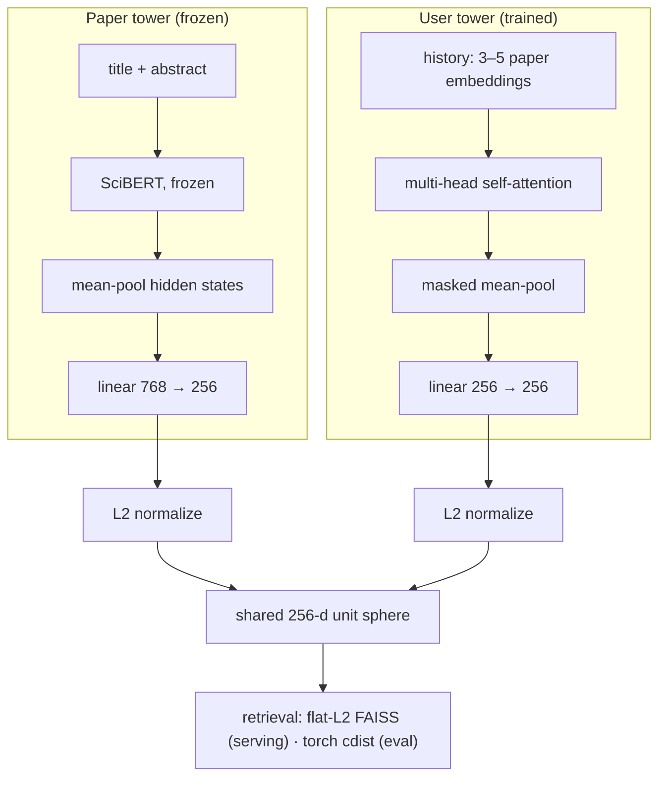
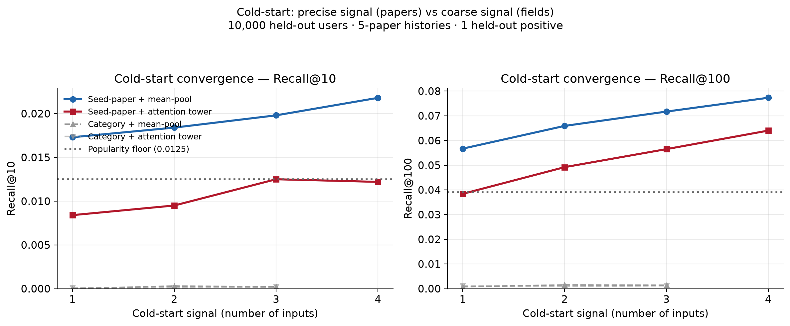

# Research Paper Recommender

Two-tower semantic recommender over a 253K-paper (CS-focused) corpus.
Frozen SciBERT paper encoder, self-attention user-history encoder, 256-d
shared space, triplet loss with chain-guarded in-batch hard negatives,
flat-FAISS retrieval.

Benchmarked against popularity, random, and mean-pool baselines. The
mean-pool baseline won, and the investigation into why is the core result.
See [ABLATION.md](ABLATION.md).

---

## Quickstart

```bash
python3 -m venv venv && source venv/bin/activate
pip install -r requirements.txt

# Smoke-test the model definitions (downloads SciBERT, ~400MB):
python scripts/tests/test_two_tower.py
```

**What a clone can and cannot run.** The data artifacts (238MB corpus, 327MB
embedding cache, 248MB FAISS index, 225MB histories) and the trained
checkpoint (`*.pt`) are gitignored — they are not in this repo. That means
**no script in `scripts/eval/` runs from a clean clone.** To reproduce the
artifacts from scratch: `export S2_API_KEY=...` (free from Semantic Scholar),
then run the `scripts/data_collection/` pipeline in the order listed in Repo
Structure below (multi-day, API-rate-limited), with the two GPU steps
(`build_embedding_cache.py`, `two_tower.py`) run on Kaggle. The eval scripts
then run locally on CPU.

**Note on reproducibility.** Neither the embedding-cache projection nor the
training run persisted its RNG state, so the pipeline produces a consistent
set of artifacts but isn't bit-reproducible. Two instances of the same class
of gap: anything that generates a downstream-anchored artifact should save
the thing that generated it. The gap only surfaces when embedding new text,
where a re-instantiated encoder yields vectors of correct shape and norm in
a different random space, so it fails the sanity check by passing it.

The same gap made provenance harder than it should have been: by write-up
time I could not tell from filenames which of three training logs belonged
to the shipped checkpoint, and identified it by its loss-scale signature and
a direct tensor comparison between `best.pt` and `last.pt`. The forensics
are in [ABLATION.md](ABLATION.md#a-note-on-artifact-provenance).

---

## Architecture



**Paper tower.** Frozen SciBERT (`allenai/scibert_scivocab_uncased`),
title + abstract, mean-pooled hidden states, linear projection to 256-d.

**User tower.** Sequence of history-paper embeddings, multi-head
self-attention, masked mean-pool, projection to 256-d.

*Hypothesis:* a user's reading history is not uniformly informative. Some
papers are core to their interests, others are incidental (a methods
citation, a one-off tangent), so a learned attention weighting should be able
to identify the signal-carrying papers and down-weight the noise, producing a
sharper fingerprint than a flat average. Mean-pool is the null: it assumes
every paper in the history is equally predictive of the next one, and
self-attention is the smallest architectural change that lets the model
contest that assumption.

The hypothesis was wrong. The six-experiment investigation into why is in
[ABLATION.md](ABLATION.md).

**Training.** Triplet loss, with in-batch negatives drawn from different
co-citation chains — same-field in effect, by corpus composition (below).

*Why hard negatives:* with random in-batch negatives the triplet task is
trivially satisfiable. Telling a user's ML paper apart from a random Medicine
paper only requires coarse topical separation, which frozen SciBERT already
provides for free, so the loss falls without the user tower learning anything
discriminative. I observed this rather than assumed it: training loss dropped
steadily while retrieval still lost to mean-pool, which is the signature of an
objective being satisfied without the actual task getting easier. Harder
negatives force CS-paper-vs-CS-paper discrimination. The sampler enforces
different-chain, not same-field — no field check needed, because 94% of the
corpus carries a CS tag (74% CS by primary field), so an in-batch negative is
a same-field paper roughly nine times out of ten by composition alone.

Hard negatives did not fix the model. It still lost to mean-pool afterward
(0.0143 vs 0.0210). That is not a failure of the technique, it is one more
ruled-out explanation, and it is why the ablation was necessary.

**Serving.** Flat L2 FAISS index over 253,703 embeddings. Exact search,
measured at 2.4ms mean / 2.5ms p95 per single query (k=10, 100 queries,
Apple Silicon CPU). IVF deferred as unnecessary at this scale. Note: none of
the numbers in Results go through FAISS — every eval script searches in plain
torch, because torch and FAISS can't share a process on this platform (see
Engineering Notes). FAISS latency is a serving property, not part of any
reported metric.

---

## Data

Synthetic user histories built from co-citation structure: papers cited
together are treated as papers read together.

**Corpus.** Semantic Scholar bulk API, 253,703 papers. 74% Computer Science
by primary field; 94% carry a CS tag somewhere in the multi-label field list.

**Histories.** Sliding windows, 3 to 5 papers, deliberately overlapping and
correlated. This was a design choice, not a data accident. Sliding windows
over a co-citation chain produce training examples that share most of their
content with their neighbors, which is a textbook setup for a model to
memorize rather than generalize. I wanted a realistic opportunity to diagnose
overfitting on data I understood the correlation structure of, rather than
reading about it. The tradeoff is that a 3-to-5 window is a short sequence,
and short sequences turned out to be the exact regime where the architecture
fails. That tension is discussed in [ABLATION.md](ABLATION.md).

**Splits.** Temporal, by the held-out positive's publication year, applied at
the co-citation-chain level rather than the example level. Verified against
the shipped artifact (`scripts/tests/check_split_integrity.py`): 106,497
chains, 0 span splits. Splitting at the example level would have leaked badly, because
overlapping windows from a single chain share history papers, so a train
example and a test example could differ by one paper and the model would score
well by recall rather than generalization.

**Scale.** ~5.03M examples across splits, ~4.1M train.

---

## Results

| Method | Recall@10 | NDCG@10 |
|---|---|---|
| Self-attention (this model) | 0.0140 | 0.0074 |
| **Mean-pool baseline** | **0.0225** | **0.0113** |
| Popularity | 0.0075 | 0.0038 |
| Random | 0.0000 | 0.0000 |

The trained model beats popularity and random, and a random-init version of
itself scores approximately zero (0.0001 — roughly one hit across three seeds
and 3,000 users) against its 0.0143, so the pipeline works. It loses to
mean-pooling.

The model is roughly 60% of the baseline's Recall@10, and the baseline has no
parameters. The gap is not a rounding error and it did not close with better
negatives, normalized geometry, or a longer training run. The honest reading is
that the learned encoder is worse than an average for this task, and the useful
question is not how to shrink the gap but what the gap is telling me. That is
what the ablation is for.

---

## Cold Start

Two cold-start signals benchmarked across 10,000 users: **seed papers** (user
names 1 to 4 papers) versus **category selection** (user names fields of
interest).

| Signal (4 inputs) | Recall@10 | Recall@100 |
|---|---|---|
| Seed papers, mean-pool | 0.0218 | 0.0773 |
| Seed papers, attention tower | 0.0122 | 0.0640 |
| Category selection | ~0.0002 | ~0.0012 |
| Popularity floor | 0.0125 | 0.0391 |



**The central result replicates.** Mean-pool beats the attention tower ~2x at
every input level, on Recall@10, NDCG@10, and Recall@100. Third independent
confirmation of the same finding, this time in the regime where sequences are
maximally short. Sharper still: on Recall@10 the trained tower never beats the
popularity floor at any input level — below it at 1, 2, and 4 inputs, tied at
3. Only seed-paper mean-pool clears the floor everywhere.

**Category selection falls below the popularity floor.** This is the more
interesting half. Selecting "Computer Science" as an interest and receiving
recommendations from the CS centroid performs worse than recommending the most
cited papers to everyone, regardless of who they are.

The mechanism is geometric. The Computer Science centroid sits at cosine 0.9998
to the mean of the entire corpus. 94% of the corpus carries a CS tag, so the CS
centroid — the mean of all CS-tagged papers — averages nearly the whole corpus,
and for retrieval purposes it and the corpus mean are the same vector. So when a user
tells the system "I'm interested in Computer Science," the query point moves
essentially nowhere. Nearest-neighbor search from the corpus mean returns
whatever happens to sit closest to the center of the embedding space, which is
not a recommendation, it's a geometric accident. The user provided a signal, the
system accepted it, and it changed nothing.

The comparison is the actual finding, and it's the one I set out to measure:
precise signal massively outperforms coarse signal for cold start, and the cost
is paid in user effort. Naming four papers is real work for a user. Clicking a
field is free. The free option produced results indistinguishable from a
signal-independent baseline. Generalized: a cold-start signal is only worth
collecting if it's discriminative *within the population you actually serve*.
A label that most of your corpus shares carries near-zero information no matter
how semantically meaningful it sounds, and that is not something you can see
without measuring the geometry.

---

## Interpretability

**Linear probe.** Logistic regression on frozen paper embeddings to predict
field-of-study: 78.4% raw accuracy, 24.8% balanced accuracy. The gap is the
finding. The headline number is inflated by class imbalance: 74% of labeled
papers are CS, and the probe's own majority-class baseline is 74.5%.
Well-represented fields (Medicine, Physics, Materials Science, Math) separate
at multiple times chance; tail fields degrade, confounded with data scarcity
rather than cleanly an embedding failure. Conclusion: the paper embeddings are
meaningful. The weakness is in the user tower, not the representations.

**Popularity-bias audit.** Citation quartiles (edges at 8 / 35 / 105 citations),
top-10 recommendations across 2,000 test users.

| | Top quartile | Bottom quartile |
|---|---|---|
| Corpus baseline | 24.9% | 25.0% |
| Attention model | 34.8% | 14.3% |
| Mean-pool | 32.4% | 17.7% |

Both methods over-surface highly cited papers by a similar margin, so the bias
originates in the embedding geometry rather than the architecture. Highly cited
papers sit in denser, more central regions that nearest-neighbor retrieval
over-returns. The learned model mildly amplifies the effect rather than
correcting it.

This is the same geometry as the cold-start result, showing up a second way: the
center of the embedding space is crowded and over-retrieved, which is why popular
papers dominate recommendations and why a query at the corpus mean (cosine 0.9998
to the CS centroid) returns nothing useful. One property of the space, two
symptoms, found in two separate investigations.

---

## Engineering Notes

**~250x training throughput, 62 hr/epoch to 15 min/epoch.**
The naive training loop was re-tokenizing and re-running full SciBERT forward
passes for every history paper and every positive, on every row, every epoch.
I caught it by timing rather than by intuition: 191s per 1,000 rows, which
extrapolates to roughly 62 hours per epoch on the full split, which is
mathematically unable to finish inside a Kaggle session. That number is what
turned "this feels slow" into "this cannot run."

The first hypothesis was dataloader I/O, so I raised `num_workers` and it didn't
help, which ruled out CPU/GPU overlap and pointed at redundant compute in the
forward path. Since SciBERT is frozen, a given paper's embedding is identical on
every epoch and every row it appears in, so the work was pure recomputation.
Precomputing all 253,703 embeddings once into a `{paperId -> 256-d vector}` cache
turned the loop into O(1) dict lookups: ~0.9s per 1,000 rows, ~15 min/epoch.

Documented constraint: the cache is only valid while SciBERT is frozen.
Unfreezing for fine-tuning would silently stale it.

**Unbounded fingerprint magnitude (the "Voyager" bug).**
The trained model scored near-random. I wrote a norm-comparison probe: raw paper
vectors sat at norm ~4.2, while the model's user fingerprints had inflated to
norm ~18,000 to ~27,000, placing them in an empty region of the space where
nearest-neighbor search returns noise.

Root cause: triplet loss is scale-invariant. It constrains relative distance, not
magnitude, so the projection was free to inflate output norms arbitrarily while
the loss kept falling. Fixed by L2-normalizing both towers onto the unit sphere,
aligning training and retrieval on one cosine geometry. Norms confirmed back at
~1.0.

The lesson is that the falling loss was telling me nothing. It was measuring
separation inside the noise floor of an enormous number, and every metric I had
at that point was consistent with a model that was learning. A training curve
alone cannot tell you your embeddings landed somewhere useful.

**Silent null column.** `positive_primary_field` was 100% null across all 5.03M
rows — the column existed by name and had been trained past for days. The fix was
not to repair the column: it is still null in `histories.parquet` today, because
nothing downstream reads it. Instead I parsed the corpus's nested
`s2FieldsOfStudy` array-of-dicts into a flat side table,
`paper_categories.parquet` (`paperId` → list of category strings), which
`cold_start_eval.py` joins against at eval time. Validated against the shipped
artifact: 253,703 rows, 0 nulls, 0 empty lists, covering every corpus paper.

What would have caught it: a schema assertion at the pipeline boundary. A single
non-null check on every generated column at write time turns a week-long silent
failure into an immediate crash, and it costs one line.

**OpenMP runtime collision.** Hard Python crash caused by `torch` and `faiss` each
bundling their own OpenMP runtime on Apple Silicon. Fixed structurally rather than
with an environment-variable override: the pipeline is split so the two libraries
never share a process. A torch-only converter writes `.npy`, a faiss-only builder
reads it.

**Server-side filter bug (Semantic Scholar API).** The `fieldsOfStudy` filter
param returned inconsistent drop rates across identical runs with identical
queries. Root-caused through systematic testing, then switched to client-side
filtering on the richer, multi-label, confidence-scored `s2FieldsOfStudy` field,
so the pipeline depends on a field that behaves rather than a param that doesn't.

---

## Repo Structure

**Where to look first.** The result this project is about lives in
`scripts/eval/`. Each of the six ablation experiments in
[ABLATION.md](ABLATION.md) maps to one script there, listed below.

### `scripts/data_collection/`
Builds the corpus and the synthetic training data.

| Script | What it does |
|---|---|
| `fetch_papers_multi.py` | Bulk-search the Semantic Scholar API across ~24 CS/ML queries, filter client-side, dedupe, write batched raw corpus. Checkpointed and resumable. |
| `clean_data.py` | Drop missing/short abstracts, dedupe by `paperId`, filter to English, write the cleaned corpus. |
| `fetch_citations.py` | Pull reference lists and publication years for every in-corpus paper. Checkpointed. |
| `build_histories.py` | Reconstruct co-citation chains, slide a 3-to-5 window over each to produce `(history → positive)` examples, assign the temporal split **at the chain level**. This is where leakage is prevented. |
| `fetch_expansion_papers.py` | Find out-of-corpus papers referenced by the corpus, fetch their metadata. This is the 69K → 253K expansion. |
| `clean_expansion.py` | Same cleaning pipeline as `clean_data.py`, applied to expansion batches, appended to the corpus. |
| `fetch_citations_incremental.py` | Citation fetch for the expansion delta only. |
| `build_embedding_cache.py` | **[Kaggle/GPU]** Run frozen SciBERT over all 253K papers once, pickle a `{paperId → 256-d vector}` cache. This is the 250x speedup. |
| `make_plots.py` | Regenerate the four writeup figures from hardcoded final-run numbers. Loads no data by design; the results are locked. |

### `scripts/models/`

| Script | What it does |
|---|---|
| `two_tower.py` | **[Kaggle/GPU]** The real training entrypoint. Contains `PaperEncoder`, `UserHistoryEncoder`, the chain-aware `CachedTripletDataset` with same-chain-guarded negative sampling, and the training loop. Produces `user_history_encoder_best.pt`. |
| `user_history_encoder_best.pt` | The trained checkpoint every eval script loads. Every number in this repo comes from this file. **Gitignored — not in the repo.** A clone must retrain to obtain it (see Quickstart). |

### `scripts/retrieval/`

| Script | What it does |
|---|---|
| `convert_cache_to_npy.py` | Torch cache dict → `(N, 256)` float32 matrix + aligned paperId array. Runs in a **separate process from FAISS** to avoid the torch/faiss OpenMP collision on Apple Silicon. |
| `build_faiss_index.py` | Build the flat-L2 index, self-query sanity check, write index + id map. |
| `centroid_calc.py` | **[Kaggle/GPU]** Per-category mean embedding over `s2FieldsOfStudy`, with a minimum-category-size floor. Produces the centroids `cold_start_eval.py` uses, including the CS centroid that turned out to be cosine 0.9998 to the corpus mean. |

### `scripts/eval/`
The benchmark, plus the six experiments that make up the ablation.

| Script | What it does | ABLATION.md |
|---|---|---|
| `evaluate.py` | Main harness. Recall@10 / NDCG@10 for the model against mean-pool, popularity, and random. Norm sanity-check runs first. | Results table |
| `diag_trained_vs_rand.py` | Trained checkpoint vs. random-init model, same architecture, same test users. | Experiment 1 |
| `diag_attn_weights.py` | Distance of learned attention weights from uniform. | Experiment 2 |
| `diag_ablation.py` | Four configs (full / no-projection / no-attention / mean-pool) against the same trained weights. | Experiment 3 |
| `eval_projected_space.py` | Re-run eval with the paper index pushed through the model's own projection, to test for space mismatch. | Experiment 4 |
| `eval_by_histlen.py` | Bucket test users by history length, report the model-vs-mean-pool gap per bucket. | Experiment 5 |
| `cold_start_eval.py` | Seed-paper vs. category-centroid signal at 1–4 inputs, against a popularity floor, on one fixed population. | Experiment 6 |
| `popularity_bias.py` | Citation-quartile distribution of top-10 recs, model vs. mean-pool vs. corpus baseline. | Interpretability |
| `linear_probes.py` | Logistic-regression probe predicting field-of-study from frozen paper embeddings. | Interpretability |
| `space_check.py` | Prints vector norms and NN distances for sample users. This is the script that caught the Voyager bug. | Engineering notes |

### Running notes

Three scripts are written for Kaggle notebooks and hardcode `/kaggle/input/`
paths: `build_embedding_cache.py`, `centroid_calc.py`, and the `__main__` block
of `two_tower.py`. They need a GPU. Everything else runs locally on CPU, and
every script in `scripts/eval/` deliberately avoids importing FAISS in-process
(search is done in plain torch) so it can't hit the OpenMP crash.

---

## What I'd Do Differently

**Persist anything that generates a downstream-anchored artifact.** The cache's
projection weights and the training run's seed were both left unsaved. The
artifacts are internally consistent but the pipeline isn't reproducible, and the
failure only shows up when you try to embed new text.

**Assert schemas at pipeline boundaries.** A one-line non-null check on generated
columns would have caught the 100%-null field column immediately instead of
several days downstream.

**Choose the history window for the task, not just the study.** The 3-to-5 window
was chosen deliberately to create overfitting risk, and it did. It also put the
model in the exact sequence-length regime where attention loses to averaging. That
tension was a knowing tradeoff rather than an oversight, but if the goal had been
to give attention a fair shot, longer histories would have been the right call.
I'd now separate the two goals into two runs instead of asking one dataset to
serve both.

**Say "CS-focused," not "scientific."** The corpus is 74% Computer Science by
primary field and 94% CS-tagged. Most of the interesting geometric findings here
(the 0.9998 centroid, the balanced-accuracy gap) are downstream of that
imbalance, and describing the corpus as broadly scientific would misrepresent
both the system and the results.

**Download Kaggle outputs immediately, and name them for the config that
produced them.** I spent an evening proving by tensor comparison which of my own
training runs had produced my own model. This is a solvable problem, and the
solution is a filename.
