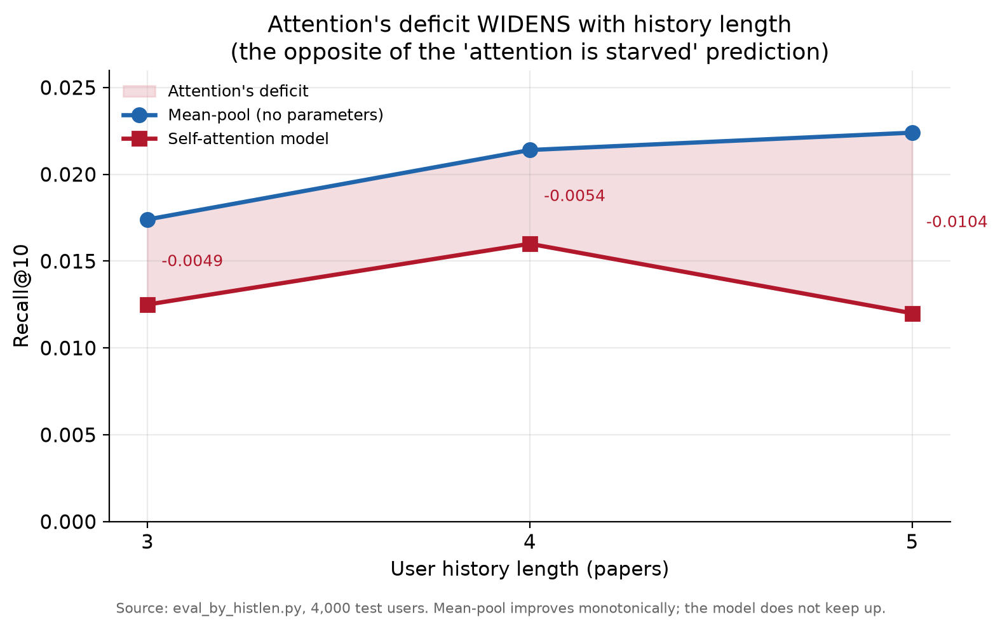
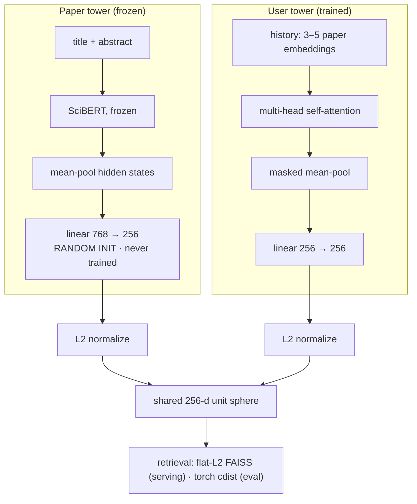

# Research Paper Recommender

**A no-parameter baseline beat my trained model, and the investigation into why
is the deliverable.** I set out to build a two-tower recommender — frozen SciBERT
paper encoder, self-attention user-history encoder — and a plain mean of the same
embeddings, with zero learned parameters, out-retrieved it by a wide margin.
Rather than tune the number up, I ran an eight-experiment ablation, which pinned the
symptom: on short, topically-uniform histories, attention is the wrong inductive
bias, and it gets *worse* the more history you give it. Diagnosis then found the
mechanism underneath it: the paper tower was never trained (its 768→256 projection
is random-init), so retrieval runs against a frozen, randomly-projected index —
what I built is effectively one-tower. That symptom-to-mechanism arc is the finding —
though testing the fix (training the paper tower, then co-training both) more than
doubled the model yet still lost to mean-pool, pointing at the short-history task
structure, not the untrained tower alone, as the residual cause (ABLATION.md Exp 7–8).

## Result: the baseline won

| Method | Recall@10 | NDCG@10 |
|---|---|---|
| Self-attention (this model) | 0.0140 | 0.0074 |
| **Mean-pool baseline** | **0.0225** | **0.0113** |
| Popularity | 0.0075 | 0.0038 |
| Random | 0.0000 | 0.0000 |

<sub>Source: `scripts/eval/evaluate.py`, 2,000 test users (random subsample, seed 42).</sub>

The trained model beats popularity and random — the pipeline works — and loses
to a parameter-free average by ~40% on Recall@10.

## The sharpest evidence: attention is destructive, not underfed



The obvious defense is that attention was *starved* — 3-to-5 paper histories are
short, so of course a learned weighting can't beat an average; give it more
sequence and it would catch up. That prediction is testable: if it were true,
the gap should **narrow** as histories get longer. It does the opposite. Every
additional paper makes mean-pool better and the model relatively worse — the
gap widens. Attention isn't underfed; it's spending signal a plain average
absorbs cleanly. Full trail — now eight experiments — in **[ABLATION.md](ABLATION.md)**.
That destructiveness is the symptom; the untrained paper tower (below) is part of the
mechanism, but not all of it. I tested the fix: training the paper tower, then
co-training both towers in one geometry, raises the model +125% (0.0140 → 0.0315) — yet
it *still* loses, because the same trained space lifts mean-pool just as much (→ 0.0410).
So the untrained tower explained the model's low absolute score, not the gap; the
residual cause is the short-history task structure of Experiment 5. See ABLATION.md
Experiments 7–8.

---

## Architecture: the hypothesis under test



**Paper tower.** Frozen SciBERT (`allenai/scibert_scivocab_uncased`),
title + abstract, mean-pooled hidden states, linear projection to 256-d — but that
projection was never trained (random-init; see the provenance audit), so in practice
the tower is frozen SciBERT under a random map.

**User tower.** Sequence of history-paper embeddings, multi-head
self-attention, masked mean-pool, projection to 256-d.

*Hypothesis:* a user's reading history is not uniformly informative. Some
papers are core to their interests, others are incidental (a methods
citation, a one-off tangent), so a learned attention weighting should be able
to identify the signal-carrying papers and down-weight the noise, producing a
sharper fingerprint than a flat average. Mean-pool is the null: it assumes
every paper in the history is equally predictive of the next one, and
self-attention is the smallest architectural change that lets the model
contest that assumption.

The hypothesis was wrong. The eight-experiment investigation into why is in
[ABLATION.md](ABLATION.md).

**Training.** Triplet loss, with in-batch negatives drawn from different
co-citation chains — same-field in effect, by corpus composition (below).
Only the user tower was ever optimized: the loop builds
`Adam(history_encoder.parameters())` and never instantiates `PaperEncoder`, so the
paper-side 768→256 projection stayed at random initialization throughout.

*Why hard negatives:* with random in-batch negatives the triplet task is
trivially satisfiable. Telling a user's ML paper apart from a random Medicine
paper only requires coarse topical separation, which frozen SciBERT already
provides for free, so the loss falls without the user tower learning anything
discriminative. I observed this rather than assumed it: training loss dropped
steadily while retrieval still lost to mean-pool, which is the signature of an
objective being satisfied without the actual task getting easier. Harder
negatives force CS-paper-vs-CS-paper discrimination. The sampler enforces
different-chain, not same-field — no field check needed, because 94% of the
corpus carries a CS tag (74% CS by primary field), so an in-batch negative is
a same-field paper roughly nine times out of ten by composition alone.

Hard negatives did not fix the model. It still lost to mean-pool afterward
(0.0143 vs 0.0210). That is not a failure of the technique, it is one more
ruled-out explanation, and it is why the ablation was necessary.

**Serving.** Flat L2 FAISS index over 253,703 embeddings. Exact search,
measured at 2.4ms mean / 2.5ms p95 per single query (k=10, 100 queries,
Apple Silicon CPU). IVF deferred as unnecessary at this scale. Note: none of
the reported numbers go through FAISS — every eval script searches in plain
torch, because torch and FAISS can't share a process on this platform (see
Engineering Notes). FAISS latency is a serving property, not part of any
reported metric.

---

## Data: histories built to overfit on purpose

Synthetic user histories built from co-citation structure: papers cited
together are treated as papers read together.

**Corpus.** Semantic Scholar bulk API, 253,703 papers. 74% Computer Science
by primary field; 94% carry a CS tag somewhere in the multi-label field list.

**Histories.** Sliding windows, 3 to 5 papers, deliberately overlapping and
correlated. This was a design choice, not a data accident. Sliding windows
over a co-citation chain produce training examples that share most of their
content with their neighbors, which is a textbook setup for a model to
memorize rather than generalize. I wanted a realistic opportunity to diagnose
overfitting on data I understood the correlation structure of, rather than
reading about it. The tradeoff is that a 3-to-5 window is a short sequence,
and short sequences turned out to be the exact regime where the architecture
fails. That tension is discussed in [ABLATION.md](ABLATION.md).

**Splits.** Temporal, by the held-out positive's publication year, applied at
the co-citation-chain level rather than the example level. Verified against
the shipped artifact (`scripts/tests/check_split_integrity.py`): 106,497
chains, 0 span splits. Splitting at the example level would have leaked badly, because
overlapping windows from a single chain share history papers, so a train
example and a test example could differ by one paper and the model would score
well by recall rather than generalization.

**Scale.** ~5.03M examples across splits, ~4.1M train.

---

## The gap is real, not a bug or noise

The model is roughly 60% of the baseline's Recall@10, and the baseline has no
parameters. A random-init version of the same architecture scores approximately
zero (0.0001 — roughly one hit across three seeds and 3,000 users) against the
trained model's 0.0143, so the model did learn; it just learned something worse
than averaging. The gap is not a rounding error and it did not close with better
negatives, normalized geometry, or a longer training run. The useful question is
not how to shrink the gap but what it's telling me. That is what the ablation is
for.

**On the two number pairs in these docs.** The main benchmark (table up top) and
the diagnostic scripts in `scripts/eval/` draw different-sized random subsamples
of the test set — 2,000 users for the benchmark, 3,000 in the ablation
experiments (see ABLATION.md) — so the same model-vs-mean-pool comparison
surfaces as 0.0140 / 0.0225 and 0.0143 / 0.0210. Those small differences are
sampling variation, not disagreement. The finding is invariant to it: mean-pool
wins by a wide margin at every sample size. Each table names the script and
sample size it came from.

---

## The finding replicates: cold start

Two cold-start signals benchmarked across 10,000 users: **seed papers** (user
names 1 to 4 papers) versus **category selection** (user names fields of
interest).

| Signal (4 inputs) | Recall@10 | Recall@100 |
|---|---|---|
| Seed papers, mean-pool | 0.0218 | 0.0773 |
| Seed papers, attention tower | 0.0122 | 0.0640 |
| Category selection | ~0.0002 | ~0.0012 |
| Popularity floor | 0.0125 | 0.0391 |

<sub>Source: `scripts/eval/cold_start_eval.py`, 10,000 users (fixed cold-start population).</sub>


**The central result replicates.** Mean-pool beats the attention tower ~2x at
every input level, on Recall@10, NDCG@10, and Recall@100. Third independent
confirmation of the same finding, this time in the regime where sequences are
maximally short. Sharper still: on Recall@10 the trained tower never beats the
popularity floor at any input level — below it at 1, 2, and 4 inputs, tied at
3. Only seed-paper mean-pool clears the floor everywhere.

**Category selection falls below the popularity floor.** This is the more
interesting half. Selecting "Computer Science" as an interest and receiving
recommendations from the CS centroid performs worse than recommending the most
cited papers to everyone, regardless of who they are.

The mechanism is geometric. The Computer Science centroid sits at cosine 0.9998
to the mean of the entire corpus. 94% of the corpus carries a CS tag, so the CS
centroid — the mean of all CS-tagged papers — averages nearly the whole corpus,
and for retrieval purposes it and the corpus mean are the same vector. So when a user
tells the system "I'm interested in Computer Science," the query point moves
essentially nowhere. Nearest-neighbor search from the corpus mean returns
whatever happens to sit closest to the center of the embedding space, which is
not a recommendation, it's a geometric accident. The user provided a signal, the
system accepted it, and it changed nothing.

The comparison is the actual finding, and it's the one I set out to measure:
precise signal massively outperforms coarse signal for cold start, and the cost
is paid in user effort. Naming four papers is real work for a user. Clicking a
field is free. The free option produced results indistinguishable from a
signal-independent baseline. Generalized: a cold-start signal is only worth
collecting if it's discriminative *within the population you actually serve*.
A label that most of your corpus shares carries near-zero information no matter
how semantically meaningful it sounds, and that is not something you can see
without measuring the geometry.

---

## The failure is the untrained index, not the embeddings' content

**Linear probe.** Logistic regression on frozen paper embeddings to predict
field-of-study: 78.4% raw accuracy, 24.8% balanced accuracy. The gap is the
finding. The headline number is inflated by class imbalance: 74% of labeled
papers are CS, and the probe's own majority-class baseline is 74.5%.
Well-represented fields (Medicine, Physics, Materials Science, Math) separate
at multiple times chance; tail fields degrade, confounded with data scarcity
rather than cleanly an embedding failure. Conclusion: the paper embeddings carry
semantic signal — field-of-study separates even under the random projection. But
usable content is not a well-structured retrieval geometry: the untrained projection
leaves the index anisotropic, and a user tower that itself did train (it scores far
above its random-init version, above) still can't beat a flat mean in that space. The
untrained paper tower is *a* cause of the model's low absolute score — training it
(ABLATION.md Exp 7–8) more than doubles the model — but it is not the cause of the
*gap*: co-training both towers lifts mean-pool by the same margin, so the model still
loses. The residual cause is the short-history task structure, not the semantic content
and not, on its own, the untrained tower.

**Popularity-bias audit.** Citation quartiles (edges at 8 / 35 / 105 citations),
top-10 recommendations across 2,000 test users.

| | Q1 (least cited) | Q2 | Q3 | Q4 (most cited) |
|---|---|---|---|---|
| Corpus baseline | 25.0% | 25.6% | 24.5% | 24.9% |
| Attention model | 14.3% | 23.7% | 27.2% | 34.8% |
| Mean-pool | 17.7% | 23.3% | 26.7% | 32.4% |

<sub>Source: `scripts/eval/popularity_bias.py`, 2,000 test users.</sub>

Both methods over-surface highly cited papers by a similar margin, so the bias
originates in the embedding geometry rather than the architecture. Highly cited
papers sit in denser, more central regions that nearest-neighbor retrieval
over-returns. The learned model mildly amplifies the effect rather than
correcting it.

This is the same geometry as the cold-start result, showing up a second way: the
center of the embedding space is crowded and over-retrieved, which is why popular
papers dominate recommendations and why a query at the corpus mean (cosine 0.9998
to the CS centroid) returns nothing useful. One property of the space, two
symptoms, found in two separate investigations.

### Artifact Provenance Audit

- `two_tower_model_best.pt` is an out-of-repo orphan (no repo script produces it). Its
  `paper_encoder.projection` is statistically indistinguishable from random init (std 0.0208
  vs fresh 0.0208; only 0.55% of weights outside the init range, max excursion 0.001). Its
  BERT backbone is bit-identical to pristine SciBERT (max diff 0.000). Its `history_encoder`
  is from a different run than the one eval uses (differs by up to 5.45). Not used by live eval.
- Live eval (`evaluate.py`) loads user tower `user_history_encoder_best.pt` and searches corpus
  `paper_matrix.npy` (253,703×256, frozen SciBERT under a random 768→256 projection).
- `two_tower.py`'s training loop never instantiates `PaperEncoder`; the optimizer is
  `Adam(history_encoder.parameters())` only; it saves only `history_encoder.state_dict()`. The
  paper tower was never trained anywhere.
- **Conclusion:** the system is effectively a one-tower model — a trained query encoder
  retrieving against a frozen, randomly-projected index.

### Anisotropy Ablation — Two Independent Problems

Live eval (2,000 users) reproduces at model R@10 0.0140 / NDCG 0.0074, mean-pool 0.0225 /
0.0113. (The 0.0143 / 0.0210 pair reported elsewhere is the same comparison at 3,000 users
rather than 2,000 — both are current live figures; see the sample-size note above.) Stripping
the top-k centered principal components — the identical transform applied to index and queries
— gives an inverted-U peaking at k=2: mean-pool 0.0225→0.0350 (+56%), model 0.0140→0.0190
(+36%). The top axis is 8.5% of variance, the top two 15.2%. Past k=2 both decline.

- **Finding A:** anisotropy is a real, removable bottleneck (~⅓–½ of recall).
- **Finding B:** it does not explain the model's loss to mean-pool — the gap widens after
  whitening (0.0350 vs 0.0190) and mean-pool leads at every k. At k=1 mean-pool is +40% while
  the model is flat, meaning the user tower already learned cone-invariance. The deficit traces
  to the untrained paper tower (see the provenance audit above).

---

## Engineering Notes

**~212x training throughput (191s → 0.9s per 1,000 rows — matched spot-timings on the same ~1,000-row slice, before vs. after caching).**
The naive training loop was re-tokenizing and re-running full SciBERT forward
passes for every history paper and every positive, on every row, every epoch.
I caught it by timing rather than by intuition: 191s per 1,000 rows (measured),
which extrapolates to a full-run projection of very roughly 218 hours per epoch
over the 4.1M-row train split — mathematically unable to finish inside a Kaggle
session. That number is what turned "this feels slow" into "this cannot run."

The first hypothesis was dataloader I/O, so I raised `num_workers` and it didn't
help, which ruled out CPU/GPU overlap and pointed at redundant compute in the
forward path. Since SciBERT is frozen, a given paper's embedding is identical on
every epoch and every row it appears in, so the work was pure recomputation.
Precomputing all 253,703 embeddings once into a `{paperId -> 256-d vector}` cache
turned the loop into O(1) dict lookups: ~0.9s per 1,000 rows — a ~212x speedup over
the naive 191s on that same ~1,000-row spot-timing slice. The full run then completed
in ~580s (~9.7 min) per epoch over all 4.1M rows, measured from the wall-clock in
`results/training_log_hardneg.csv`. That full-run rate is faster per row than the
small-slice spot-timing because fixed setup/warmup cost amortizes away over the full
run — the two are different measurements, not a cross-check.

Documented constraint: the cache is only valid while SciBERT is frozen.
Unfreezing for fine-tuning would silently stale it.

**Unbounded fingerprint magnitude (the "Voyager" bug).**
The trained model scored near-random. I wrote a norm-comparison probe: raw paper
vectors sat at norm ~4.2, while the model's user fingerprints had inflated to
norm ~18,000 to ~27,000, placing them in an empty region of the space where
nearest-neighbor search returns noise.

Root cause: triplet loss is scale-invariant. It constrains relative distance, not
magnitude, so the projection was free to inflate output norms arbitrarily while
the loss kept falling. Fixed by L2-normalizing both towers onto the unit sphere,
aligning training and retrieval on one cosine geometry. Norms confirmed back at
~1.0.

The lesson is that the falling loss was telling me nothing. It was measuring
separation inside the noise floor of an enormous number, and every metric I had
at that point was consistent with a model that was learning. A training curve
alone cannot tell you your embeddings landed somewhere useful.

**Silent null column.** `positive_primary_field` was 100% null across all 5.03M
rows — the column existed by name and had been trained past for days. The fix was
not to repair the column: it is still null in `histories.parquet` today, because
nothing downstream reads it. Instead I parsed the corpus's nested
`s2FieldsOfStudy` array-of-dicts into a flat side table,
`paper_categories.parquet` (`paperId` → list of category strings), which
`cold_start_eval.py` joins against at eval time. Validated against the shipped
artifact: 253,703 rows, 0 nulls, 0 empty lists, covering every corpus paper.

What would have caught it: a schema assertion at the pipeline boundary. A single
non-null check on every generated column at write time turns a week-long silent
failure into an immediate crash, and it costs one line.

**OpenMP runtime collision.** Hard Python crash caused by `torch` and `faiss` each
bundling their own OpenMP runtime on Apple Silicon. Fixed structurally rather than
with an environment-variable override: the pipeline is split so the two libraries
never share a process. A torch-only converter writes `.npy`, a faiss-only builder
reads it.

**Server-side filter bug (Semantic Scholar API).** The `fieldsOfStudy` filter
param returned inconsistent drop rates across identical runs with identical
queries. Root-caused through systematic testing, then switched to client-side
filtering on the richer, multi-label, confidence-scored `s2FieldsOfStudy` field,
so the pipeline depends on a field that behaves rather than a param that doesn't.

---

## Running it & reproducibility

```bash
python3 -m venv venv && source venv/bin/activate
pip install -r requirements.txt

# Smoke-test the model definitions (downloads SciBERT, ~400MB):
python scripts/tests/test_two_tower.py
```

**What a clone can and cannot run.** The data artifacts (238MB corpus, 327MB
embedding cache, 248MB FAISS index, 225MB histories) and the trained
checkpoint (`*.pt`) are gitignored — they are not in this repo. That means
**no script in `scripts/eval/` runs from a clean clone.** To reproduce the
artifacts from scratch: `export S2_API_KEY=...` (free from Semantic Scholar),
then run the `scripts/data_collection/` pipeline in the order listed in Repo
Structure below (multi-day, API-rate-limited), with the two GPU steps
(`build_embedding_cache.py`, `two_tower.py`) run on Kaggle. The eval scripts
then run locally on CPU.

**Note on reproducibility.** Neither the embedding-cache projection nor the
training run persisted its RNG state, so the pipeline produces a consistent
set of artifacts but isn't bit-reproducible. Two instances of the same class
of gap: anything that generates a downstream-anchored artifact should save
the thing that generated it. The gap only surfaces when embedding new text,
where a re-instantiated encoder yields vectors of correct shape and norm in
a different random space, so it fails the sanity check by passing it.

The same gap made provenance harder than it should have been: by write-up
time I could not tell from filenames which of three training logs belonged
to the shipped checkpoint, and identified it by its loss-scale signature and
a direct tensor comparison between `best.pt` and `last.pt`. The forensics
are in [ABLATION.md](ABLATION.md#a-note-on-artifact-provenance).

---

## Repo Structure

**Where to look first.** The result this project is about lives in
`scripts/eval/`. Each of the eight ablation experiments in
[ABLATION.md](ABLATION.md) maps to an eval script there, listed below — though
Experiments 7–8 also depend on training and index-build scripts in
`scripts/models/` and `scripts/retrieval/`, likewise listed below.

### `scripts/data_collection/`
Builds the corpus and the synthetic training data.

| Script | What it does |
|---|---|
| `fetch_papers_multi.py` | Bulk-search the Semantic Scholar API across ~24 CS/ML queries, filter client-side, dedupe, write batched raw corpus. Checkpointed and resumable. |
| `clean_data.py` | Drop missing/short abstracts, dedupe by `paperId`, filter to English, write the cleaned corpus. |
| `fetch_citations.py` | Pull reference lists and publication years for every in-corpus paper. Checkpointed. |
| `build_histories.py` | Reconstruct co-citation chains, slide a 3-to-5 window over each to produce `(history → positive)` examples, assign the temporal split **at the chain level**. This is where leakage is prevented. |
| `fetch_expansion_papers.py` | Find out-of-corpus papers referenced by the corpus, fetch their metadata. This is the 69K → 253K expansion. |
| `clean_expansion.py` | Same cleaning pipeline as `clean_data.py`, applied to expansion batches, appended to the corpus. |
| `fetch_citations_incremental.py` | Citation fetch for the expansion delta only. |
| `build_embedding_cache.py` | **[Kaggle/GPU]** Run frozen SciBERT over all 253K papers once, pickle a `{paperId → 256-d vector}` cache. This is the ~212x speedup. |
| `make_plots.py` | Regenerate the five writeup figures from hardcoded final-run numbers. Loads no data by design; the results are locked. |

### `scripts/models/`

| Script | What it does |
|---|---|
| `two_tower.py` | **[Kaggle/GPU]** The real training entrypoint. Contains `PaperEncoder`, `UserHistoryEncoder`, the chain-aware `CachedTripletDataset` with chain-guarded negative sampling, and the training loop. Produces `user_history_encoder_best.pt`. |
| `train_paper_projection.py` | **Experiment 7.** Trains only a fresh paper projection `nn.Linear(768→256)` on `paper_768_full.npy` against the *frozen* trained user tower (same triplet objective), isolating the paper space as the single changed variable. Produces `paper_projection_trained.pt`. |
| `train_cotrained.py` | **Experiment 8.** Co-trains a fresh user tower and a fresh `nn.Linear(768→256)` paper projection jointly in one geometry (525,824 params, in-batch semi-hard negatives; SciBERT never instantiated). Produces `user_tower_cotrained.pt` and `paper_projection_cotrained.pt`. |
| `paper_projection_trained.pt`, `user_tower_cotrained.pt`, `paper_projection_cotrained.pt` | The Exp 7–8 checkpoints produced by the two trainers above. **Gitignored — not in the repo.** |
| `user_history_encoder_best.pt` | The trained user tower behind the main benchmark, Experiments 1–6, and the query side of Experiment 7. Experiments 7–8 add trained paper-side artifacts: Exp 7 keeps this query encoder but searches `paper_matrix_trainedproj.npy` (built from `paper_projection_trained.pt`); Exp 8 (`eval_cotrained.py`) instead loads the co-trained user tower `user_tower_cotrained.pt` and searches `paper_matrix_cotrained.npy` (built from `paper_projection_cotrained.pt`). **Gitignored — not in the repo.** A clone must retrain to obtain it (see Running it & reproducibility). |

### `scripts/retrieval/`

| Script | What it does |
|---|---|
| `convert_cache_to_npy.py` | Torch cache dict → `(N, 256)` float32 matrix + aligned paperId array. Runs in a **separate process from FAISS** to avoid the torch/faiss OpenMP collision on Apple Silicon. |
| `build_faiss_index.py` | Build the flat-L2 index, self-query sanity check, write index + id map. |
| `centroid_calc.py` | **[Kaggle/GPU]** Per-category mean embedding over `s2FieldsOfStudy`, with a minimum-category-size floor. Produces the centroids `cold_start_eval.py` uses, including the CS centroid that turned out to be cosine 0.9998 to the corpus mean. |
| `build_matrix_from_projection.py` | **Experiment 7 index.** Applies `paper_projection_trained.pt` to `paper_768_full.npy` → `paper_matrix_trainedproj.npy` (253,703×256, row-aligned to `paper_ids.npy`), stored raw for load-time normalization. |
| `build_cotrained_matrix.py` | **Experiment 8 index.** Applies `paper_projection_cotrained.pt` to `paper_768_full.npy` → `paper_matrix_cotrained.npy`, so query and index share the co-trained geometry. |
| `rebuild_matrix_trainedproj.py` | Alternate trained-projection index: re-encodes all 253,703 papers with the trained `paper_encoder.projection` from `two_tower_model_best.pt`, reusing `build_embedding_cache` so only the projection weights differ. |

### `scripts/eval/`
The benchmark, plus the eight experiments that make up the ablation.

| Script | What it does | ABLATION.md |
|---|---|---|
| `evaluate.py` | Main harness. Recall@10 / NDCG@10 for the model against mean-pool, popularity, and random. Norm sanity-check runs first. | Results table |
| `diag_trained_vs_rand.py` | Trained checkpoint vs. random-init model, same architecture, same test users. | Experiment 1 |
| `diag_attn_weights.py` | Distance of learned attention weights from uniform. | Experiment 2 |
| `diag_ablation.py` | Four configs (full / no-projection / no-attention / mean-pool) against the same trained weights. | Experiment 3 |
| `eval_projected_space.py` | Re-run eval with the paper index pushed through the model's own projection, to test for space mismatch. | Experiment 4 |
| `eval_by_histlen.py` | Bucket test users by history length, report the model-vs-mean-pool gap per bucket. | Experiment 5 |
| `cold_start_eval.py` | Seed-paper vs. category-centroid signal at 1–4 inputs, against a popularity floor, on one fixed population. | Experiment 6 |
| `eval_trainedproj.py` | Train the paper projection alone (user tower frozen), decoupled eval — isolates tower–geometry coupling. | Experiment 7 |
| `eval_cotrained.py` | Co-train both towers in one geometry, full-index eval — the fix the chain implies. | Experiment 8 |
| `popularity_bias.py` | Citation-quartile distribution of top-10 recs, model vs. mean-pool vs. corpus baseline. | Interpretability |
| `linear_probes.py` | Logistic-regression probe predicting field-of-study from frozen paper embeddings. | Interpretability |
| `space_check.py` | Prints vector norms and NN distances for sample users. This is the script that caught the Voyager bug. | Engineering notes |
| `diag_build_768_sample.py` | Rebuilds raw 768-d mean-pooled SciBERT vectors (the pre-projection space that was never saved) — the input the geometry diagnostics need. | Provenance / geometry |
| `diag_space_geometry.py` | Why the category centroids collapse: 768-d vs 256-d centroid spread, SciBERT anisotropy, and the random-projection forensic (does the checkpoint's projection reproduce the cache?). | Provenance / geometry |
| `diag_dispersion_eval.py` | Dispersion-stratified eval — does the model's deficit shrink as histories get topically more diverse? | Experiment 5 (follow-up) |
| `diag_contaminated_hist.py` | Contaminated-history eval — inject off-topic papers into homogeneous histories; can attention gate them better than mean-pool? | Experiment 5 (follow-up) |

### Running notes

Three scripts are written for Kaggle notebooks and hardcode `/kaggle/input/`
paths: `build_embedding_cache.py`, `centroid_calc.py`, and the `__main__` block
of `two_tower.py`. They need a GPU. Everything else runs locally on CPU, and
every script in `scripts/eval/` deliberately avoids importing FAISS in-process
(search is done in plain torch) so it can't hit the OpenMP crash.

---

## What I'd Do Differently

**Persist anything that generates a downstream-anchored artifact.** The cache's
projection weights and the training run's seed were both left unsaved. The
artifacts are internally consistent but the pipeline isn't reproducible, and the
failure only shows up when you try to embed new text.

**Assert schemas at pipeline boundaries.** A one-line non-null check on generated
columns would have caught the 100%-null field column immediately instead of
several days downstream.

**Choose the history window for the task, not just the study.** The 3-to-5 window
was chosen deliberately to create overfitting risk, and it did. It also put the
model in the exact sequence-length regime where attention loses to averaging. That
tension was a knowing tradeoff rather than an oversight, but if the goal had been
to give attention a fair shot, longer histories would have been the right call.
I'd now separate the two goals into two runs instead of asking one dataset to
serve both.

**Say "CS-focused," not "scientific."** The corpus is 74% Computer Science by
primary field and 94% CS-tagged. Most of the interesting geometric findings here
(the 0.9998 centroid, the balanced-accuracy gap) are downstream of that
imbalance, and describing the corpus as broadly scientific would misrepresent
both the system and the results.

**Download Kaggle outputs immediately, and name them for the config that
produced them.** I spent an evening proving by tensor comparison which of my own
training runs had produced my own model. This is a solvable problem, and the
solution is a filename.
